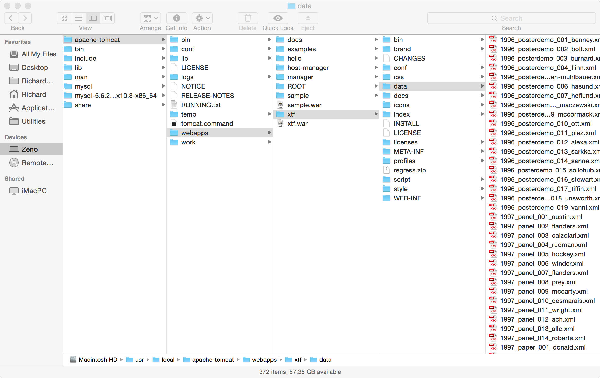
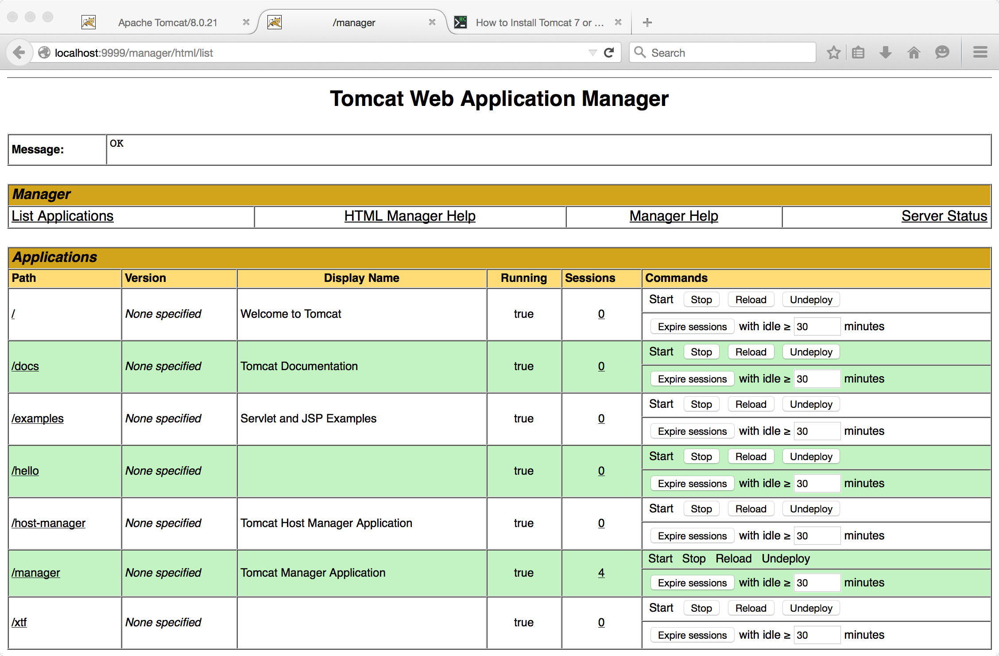
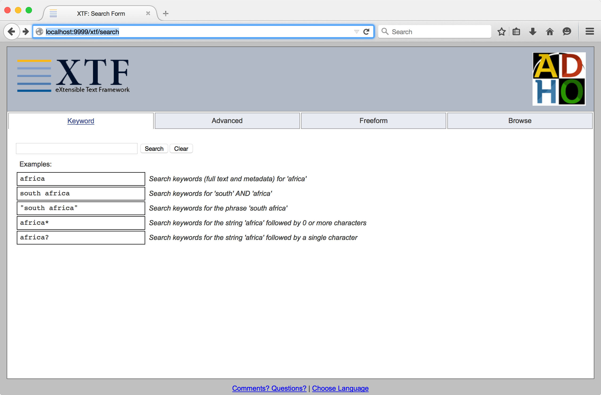
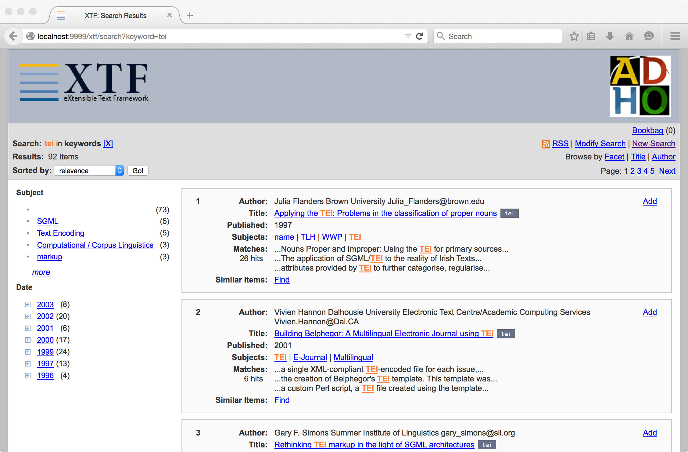

##DH Abstracts Documentation
Richard Higgins, PhD (English), pending MIS (InfoSci)  
Indiana University, Bloomington  
[rshiggin.net](http://www.rshiggins.net/)  

####Versions
XTF 3.1
Apache Tomcat 8.0.21
Java SE 8u45 (JDK)
Mac OS X 10.10 Yosemite

####Install help
<a href="http://wolfpaulus.com/jounal/mac/tomcat8/">wolfpaulus.com/jounal/mac/tomcat8</a>
<a href="http://xtf.cdlib.org/documentation/deployment-guide/">xtf.cdlib.org/documentation/deployment-guide</a>

####Verify Java environment
```
$ echo $JAVA_HOME    
/Library/Java/JavaVirtualMachines/jdk1.8.0_20.jdk/Contents/Home    
$ java -version    
java version "1.8.0_20"    
Java(TM) SE Runtime Environment (build 1.8.0_20-b26)    
Java HotSpot(TM) 64-Bit Server VM (build 25.20-b23, mixed mode)
```   

####Tomcat set directory and permissions    

```
$ sudo mkdir -p /usr/local    
$ sudo mv ~/Downloads/apache-tomcat /usr/local
$ sudo rm -f /Library/Tomcat
$ sudo ln -s /usr/local/apache-tomcat /Library/Tomcat
$ sudo chown -R Richard /Library/Tomcat
$ sudo chmod +x /Library/Tomcat/bin/*.sh
```

     


####Set localhost port
>Open tomcat/conf/server.xml
>Go to "Connector port"
>Replace "8080" with "9999" (or other)
>Restart tomcat server.


http://localhost:9999
   


####Permissions for Tomcat admin
Edit __tomcat/conf/tomcat-users.xml__
```
<role rolename="user"/>
<user username="user" password="------------" roles="-------"/>
```

 

####Verify Tomcat Java paths
__run bin/catalina.sh__     

```
$ ./catalina.sh run
Using CATALINA_BASE: /usr/local/apache-tomcat
Using CATALINA_HOME: /usr/local/apache-tomcat
Using CATALINA_TMPDIR: /usr/local/apache-tomcat/temp
Using JRE_HOME: /Library/Java/JavaVirtualMachines/jdk1.8.0_20.jdk/Contents/Home
Using CLASSPATH: /usr/local/apache-tomcat/bin/bootstrap.jar:/usr/local/apache-tomcat
```

####Solution for Java path bug: Tomcat 8.0/XTF 3.0
```
java.lang.NullPointerException
	java.io.File.<init>(Unknown Source)
	org.cdlib.xtf.servletBase.TextServlet.firstTimeInit(TextServlet.java:281)
	org.cdlib.xtf.servletBase.TextServlet.service(TextServlet.java:361)
	javax.servlet.http.HttpServlet.service(HttpServlet.java:725)
	org.apache.tomcat.websocket.server.WsFilter.doFilter(WsFilter.java:52)
```

In WEB-INF/web.xml, look for this section:
```
    <servlet>
        <servlet-name>crossQuery</servlet-name>
        <servlet-class>org.cdlib.xtf.crossQuery.CrossQuery</servlet-class>
    </servlet>
```
and add a base-dir parameter like this:
```
    <servlet>
        <servlet-name>crossQuery</servlet-name>
        <servlet-class>org.cdlib.xtf.crossQuery.CrossQuery</servlet-class>
        <init-param>
            <param-name>base-dir</param-name>
            <param-value>YOUR_PATH_HERE</param-value>
        </init-param>
    </servlet>
```
<a href="https://groups.google.com/forum/#!topic/xtf-user/ZcRdb90qV6Q">groups.google.com/forum/#!topic/xtf-user/ZcRdb90qV6Q</a>

####Set permissions for XTF textIndexer
__webapps/xtf/bin__
```
$ chmod +x textIndexer 
$ ./textIndexer -index default
```

__http://localhost:9999/xtf/search__   

       

     
      
      

####Java CLASSPATH help
$ export JAVA_HOME="/Library/Java/JavaVirtualMachines/jdk1.8.0_20.jdk/Contents/Home"
$ echo $JAVA_HOME
```
/Library/Java/JavaVirtualMachines/jdk1.8.0_20.jdk/Contents/Home
```

See all installed java versions,  (Please note the capital V, simple v will be used later on for different purpose)
$ /usr/libexec/java_home -V  
```
Outputs..
 Matching Java Virtual Machines (4):  
   1.8.0_25, x86_64:  "Java SE 8"  /Library/Java/JavaVirtualMachines/jdk1.8.0_25.jdk/Contents/Home  
   1.7.0_71, x86_64:  "Java SE 7"  /Library/Java/JavaVirtualMachines/jdk1.7.0_71.jdk/Contents/Home  
   1.6.0_65-b14-466.1, x86_64:  "Java SE 6"  /System/Library/Java/JavaVirtualMachines/1.6.0.jdk/Contents/Home  
   1.6.0_65-b14-466.1, i386:  "Java SE 6"  /System/Library/Java/JavaVirtualMachines/1.6.0.jdk/Contents/Home
```  
Now you know whats available. All you need to do now is change your ~/.bash_profile to set JAVA_HOME. Before we do so, lets see how we can use /usr/libexec/java_home tool to retrieve JAVA_HOME paths of each versions.

Following command gives JAVA_HOME path of a given java version installed.
$ /usr/libexec/java_home -v  

__v1.8__
$ /usr/libexec/java_home -v 1.8  

```
/Library/Java/JavaVirtualMachines/jdk1.8.0_25.jdk/Contents/Home
```

__v1.7__
$ /usr/libexec/java_home -v 1.7 
``` 
 /Library/Java/JavaVirtualMachines/jdk1.7.0_71.jdk/Contents/Home
```

Now, lets add that trick to our ~/.bash_profile.
```
 export JAVA_HOME=`/usr/libexec/java_home -v 1.8`  
 #export JAVA_HOME=`/usr/libexec/java_home -v 1.7`  
 #export JAVA_HOME=`/usr/libexec/java_home -v 1.6`
``` 
  
Uncomment the version you need when you need it.

Source: <a href="http://asanga.blogspot.com/2015/01/setting-up-multiple-javahome-versions.html">asanga.blogspot.com/</a>

##Customizing XTF (XSLT stylesheets and CSS customization)  

__Directories and key config files__    

  
```  
```
#####Search form/start page

__modify XSLT__ "searchForms.xsl" 
```
style/crossQuery/resultFormatter/default/searchForms.xsl
```
  1. disable Freeform search
  2. change Examples to match content of site: from "south africa" to "digital archive" 

>view: [searchForms.xsl](resultFormatter/default/searchForms.xsl)  
  
__modify CSS__ "results.css" 
```
css/default/results.css 

  1. change to ADHO site "blue"
  2. modify header margin, padding
  3. add logos and site title  
  4. change text and link color  
  
>view: [results.css](css/default/results.css)

__Prototype for custom interface__     
      


####Customize Revisions

####Reindex
```
$ /usr/local/apache-tomcat/webapps/xtf/bin/textIndexer -clean -index default
```


